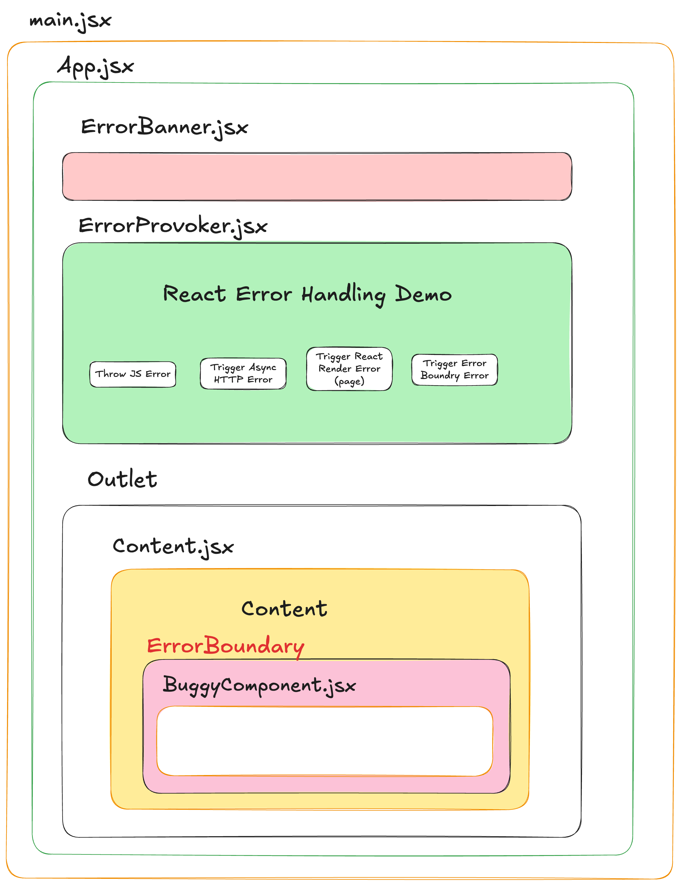

# Error handling in a react application

There are many types of errors that can occur in a React application. These errors can be caused by a variety of factors, such as bugs in the code, network issues, or problems with the rendering process. In this example, we will demonstrate different types of errors that can occur in a React application and how to handle them.

## 4 main types of errors

1. **JS runtime errors**: These are errors that occur when the code is running. These are the most common type of errors and are usually caused by a mistake in the code, type errors, etc.

2. **Network errors**: These are errors that occur when the application is trying to communicate with a server. These errors are usually caused by a problem with the network connection. Often you will handle these errors with a `try...catch` statement.

3. **React render errors**: These are errors that occur when the React application is rendering. These errors are usually caused by a problem with the React code. Missing props, undefined variables, etc.

4. **Routing errors**: These are errors that occur when the application is trying to navigate to a different page. These errors are usually caused by a problem with the routing configuration. Missing routes, incorrect paths, etc.

## How to handle errors in React

In this example the `ErrorProvoker` component shows 4 buttons.

1. button throws a JS runtime error (handled by a `try...catch` statement)
2. button throws a network error (handled by a `try...catch` statement)
3. button throws a React render error (handled by the react router `errorElement`)
4. button shows a child component that has a render error (handled by the `ErrorBoundary` component)

The 2 first errors are shown in an error banner at the top of the App component. The 3rd error is shown in the error page provided with the react router routes `errorElement`. The 4th error is shown in the child component itself using the `ErrorBoundary` component.

Notice that the global error handling (catch all) is set up in the `App` component using the `setGlobalErrorHandling` function. This
function is operating at the root level of the application and will catch all errors that are not caught by try-catch, `errorElement` or `ErrorBoundary` components. In this demo, we cannot show the errors in React. This will take more effort. So we will just show the errors in the console. The rest of the errors are shown in the UI.

## Page not found (404)

The `PageNotFound` component is shown when the user navigates to a page that does not exist. This is handled by the react router `PageNotFound` component.

## How to run the example

1. Clone the repository
2. Run `npm install`
3. Run `npm start`

## Overview of the components

